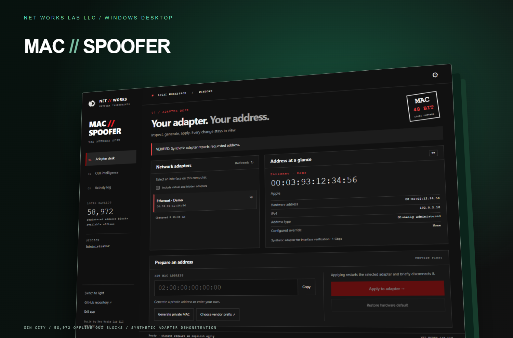
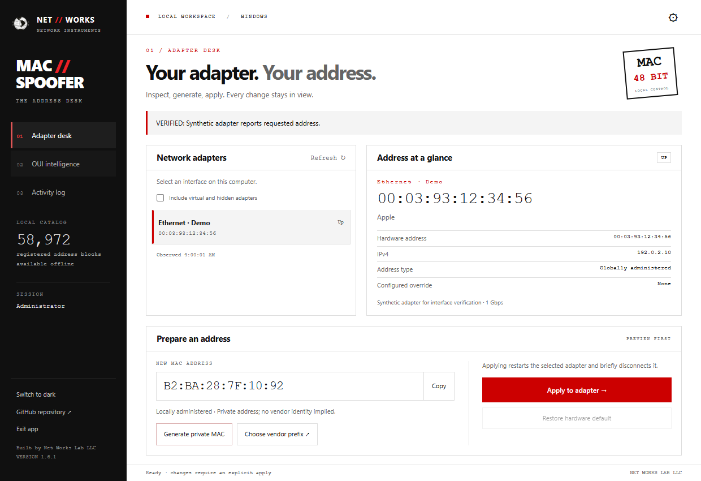
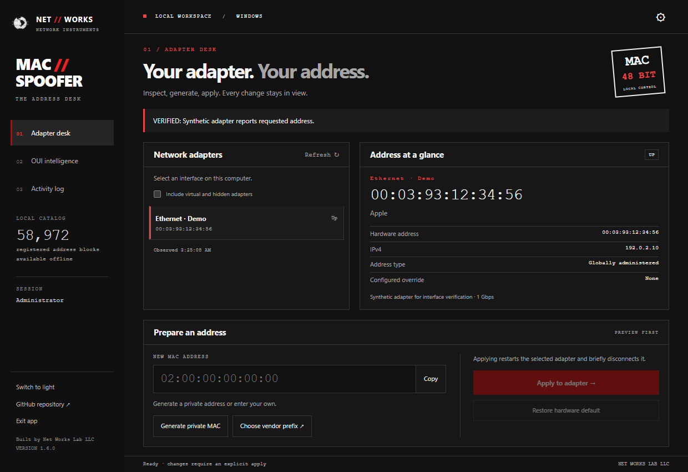
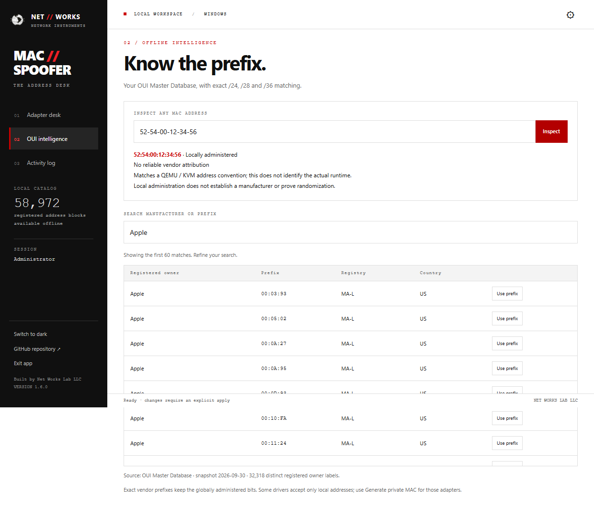
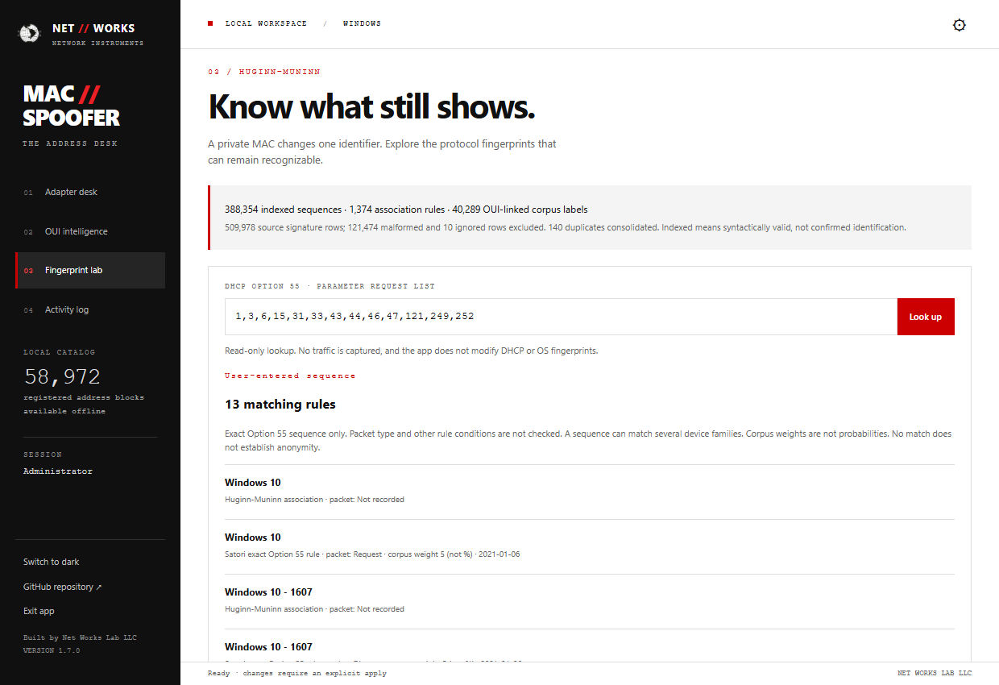

<div align="center">


`Windows` [`Python`](https://www.python.org/) [`pywebview`](https://pywebview.flowrl.com/) `Offline OUI` — Native address control with a Sin City desktop, exact vendor prefixes, observed driver outcomes and recovery records.

[](https://git.io/typing-svg)




<br>

[](https://github.com/Ringmast4r/MAC-SPOOFER)
[](https://github.com/Ringmast4r/MAC-SPOOFER/tree/main)

[](https://github.com/Ringmast4r/MAC-SPOOFER/stargazers)
[](https://github.com/Ringmast4r/MAC-SPOOFER/network/members)
[](https://github.com/Ringmast4r/MAC-SPOOFER)
[](https://github.com/Ringmast4r/MAC-SPOOFER/commits/main)

</div>

## `> cat project.txt`

MAC // Spoofer 1.7.0 rebuilds the Windows desktop as a one-file native app using the operating system's WebView2 runtime. It replaces Tkinter with the Net Works Sin City house style: light by default, remembered dark mode, a black rail and blood-red controls. Original 1.5 source and documentation remain in `legacy/`.

- **Adapter desk:** current and driver-reported permanent MAC, IPv4, connection state and configured override. Read-only refresh every 20 seconds or on demand; physical and virtual interfaces.
- **Prepare before applying:** cryptographically random local unicast addresses, manual input, a vendor-based local address (legacy behavior) or an explicit exact registered prefix. Generating and selecting never modify an adapter.
- **Offline intelligence:** 58,972 address blocks and 32,318 distinct owner labels from OUI Master Database's September 30, 2026 snapshot. Longest-prefix /24, /28 and /36 matching, country and source attribution.
- **Apply and restore:** exact interface GUID targeting, explicit restart confirmation, durable pre-change journal, observed-address verification and recovery of the previous registry setting after an unsuccessful apply.
- **Selection guidance:** private versus exact-prefix recommendations, local adapter collision checks, and corroborating Huginn-Muninn labels without attributing local addresses to manufacturers.
- **Fingerprint lab:** 388,354 cleaned Option 55 sequences and 1,374 association rules, offline device-reference browsing, preserved source conditions and weights, and explanations of identity signals a MAC change leaves untouched.
- **Desktop lifecycle:** user-selected **Blade / Sin City 14** shortcut and tray, the Net Works globe inside the app, one instance, close to tray, Open and Exit, three shortcuts, activity and JSON export.

## `> open windows.exe`

Open **MAC_Spoofer.exe** in the project root or the installed **MAC Spoofer** shortcut. `dist/MAC_Spoofer.exe` is the same build. Python is bundled. Windows and Microsoft Edge WebView2 are runtime requirements; Electron is not used.

Inspection and generation work without elevation. Open the top-right gear and choose **Relaunch as administrator** before applying or restoring. Windows supplies the UAC prompt. Applying restarts the selected adapter and briefly interrupts its connection. Launching or exiting does not change an address.

The app listens only on `127.0.0.1:8802`. API calls require a per-session token and pass Host/Origin checks. No telemetry is sent. Settings, activity and the pre-change `changes.jsonl` journal live in `%LOCALAPPDATA%\NetWorksLab\MACSpoofer`, outside bundled resources and the public repository.

## `> view desktop`

These are real interface renders with **synthetic adapter data**, so no owner network addresses are published. Simulated verification messages are not evidence of physical adapter changes.







## `> understand address_identity`

A local address does not prove randomization or identify a manufacturer. Docker, VMware NSX and QEMU/KVM prefix conventions are labeled as conventions, not confirmed runtimes. This distinction was informed by the existing Leetha MAC-intelligence work; no Leetha scanning or device-correlation engine is bundled.

Vendor selections default to the old generator's locally administered conversion. The preview now labels this as a local address based on the selected vendor, without claiming vendor identity. Select **Exact registered prefix** to retain the original prefix bits. Applying clears the existing override and resets the selected adapter before writing the new address, with the legacy three-second disable/enable settling delays. Some drivers reject globally administered addresses or ignore all overrides. A registry write alone is never reported as success. Removing an override is marked **unverified** if Windows does not provide a permanent address for comparison.

A MAC change leaves hostnames, DHCP fingerprints, accounts and other independent identity signals unchanged. No universal driver compatibility is claimed.

The Fingerprint Lab compares user-entered DHCP Option 55 sequences with the offline corpus; it does not capture traffic or rewrite DHCP. Known sequences without mappings are distinguished from rule matches. Reference examples are labeled, packet-type and additional constraints remain unverified, and weights are not confidence percentages. See [corpus provenance and coverage](data/HUGINN-SOURCES.md).

## `> tech_stack --full`

| Layer | Implementation |
|---|---|
| Language | Python 3.11; standard-library HTTP server, SQLite, ctypes, subprocess and winreg |
| Native host | pywebview 6.2.1, pythonnet 3.2.0, clr_loader 0.3.1 and Windows WebView2 |
| Interface | Local HTML, CSS and JavaScript; house tokens, no remote UI dependencies |
| Engine | PowerShell NetAdapter read/restart operations; exact GUID-to-registry matching; adapter names never interpolated into commands |
| Storage | Read-only bundled SQLite OUI catalog; local settings, log and pre-change journal |
| Permissions | Normal read-only launch; administrator restart for changes; authenticated loopback API |
| Windows shell | Ported SANS desktop shell: named mutex/event, native window identity, ctypes Shell_NotifyIcon tray and AppUserModelID shortcuts |
| Artwork | Existing Net Works globe and owner-selected Blade; original art, white rounded tile and ten shortcut ICO sizes included |
| Build | PyInstaller 6.22.3 one-file windowed EXE; Pillow 12.3.0 icons; VERSION supplies app and Windows resource versions |
| Checks | pytest, Playwright synthetic-adapter UI checks, read-only Windows enumeration and packaged lifecycle verification |

Flow: local interface → session-protected API → background adapter worker → exact registry entry and Windows restart → observed-address reread → result and local log. OUI lookups remain offline.

`src/macspoofer/engine.py` owns Windows operations, `oui.py` validation/classification/catalog, `service.py` workers and state, `server.py` the HTTP boundary, and `app.py`, `window.py`, `shellutil.py`, `tray.py` the native lifecycle. Interface source is in `public/`.

## `> build --windows`

```powershell
py -3.11 -m venv .venv
.\.venv\Scripts\python.exe -m pip install -r requirements-dev.txt
.\.venv\Scripts\python.exe -m pytest -q
.\.venv\Scripts\python.exe scripts\check_ui.py
.\.venv\Scripts\python.exe scripts\build_exe.py --stage
.\.venv\Scripts\python.exe scripts\build_exe.py --install-only
```

The UI check uses headless Chrome with an isolated profile and synthetic adapters. Staging preserves the running app; installation requests a clean exit and refuses to interrupt an active adapter operation. It stamps Desktop, Start Menu and project-folder shortcuts against the actual root EXE.

Refresh the offline catalog using `scripts/import_oui.py PATH/TO/master_oui.json`. `data/provenance.json` records source, snapshot time, SHA-256 and counts. There is no automatic download at launch. Principal runtime and build dependencies are pinned in the requirements files.

## `> cli --help`

```powershell
py -3.11 mac_spoofer.py --list
py -3.11 mac_spoofer.py --random
py -3.11 mac_spoofer.py --lookup 00:03:93:12:34:56
py -3.11 mac_spoofer.py --search Apple
```

The CLI uses the same engine. Applying requires an exact interface GUID, administrator rights, explicit restart acknowledgement and a selected action. Current mutation support is Windows-only. Historical Linux/macOS code remains in `legacy/` and was not verified for this release. A Chrome extension is outside this Windows EXE refactor.

## `> verification_and_limits`

See [verification](docs/VERIFICATION.md). No physical MAC changes were performed during the rebuild. UAC acceptance and driver compatibility require owner use. Success, rejection and recovery paths were tested against simulated drivers; real enumeration was read-only.

## `> sources`

- [OUI Master Database](https://github.com/Ringmast4r/OUI-Master-Database): public snapshot, with IEEE, Wireshark, Nmap and HDM source attribution.
- [Windows NetAdapter documentation](https://learn.microsoft.com/en-us/powershell/module/netadapter/): Windows and driver-dependent adapter operations.
- [pywebview API](https://pywebview.flowrl.com/api/): native host lifecycle.
- [Net Works icon gallery](https://networks-corp.com/icon-demos/): Blade, Sin City 14.

[License and original use terms](LICENSE). Existing repository visibility and history are preserved.


