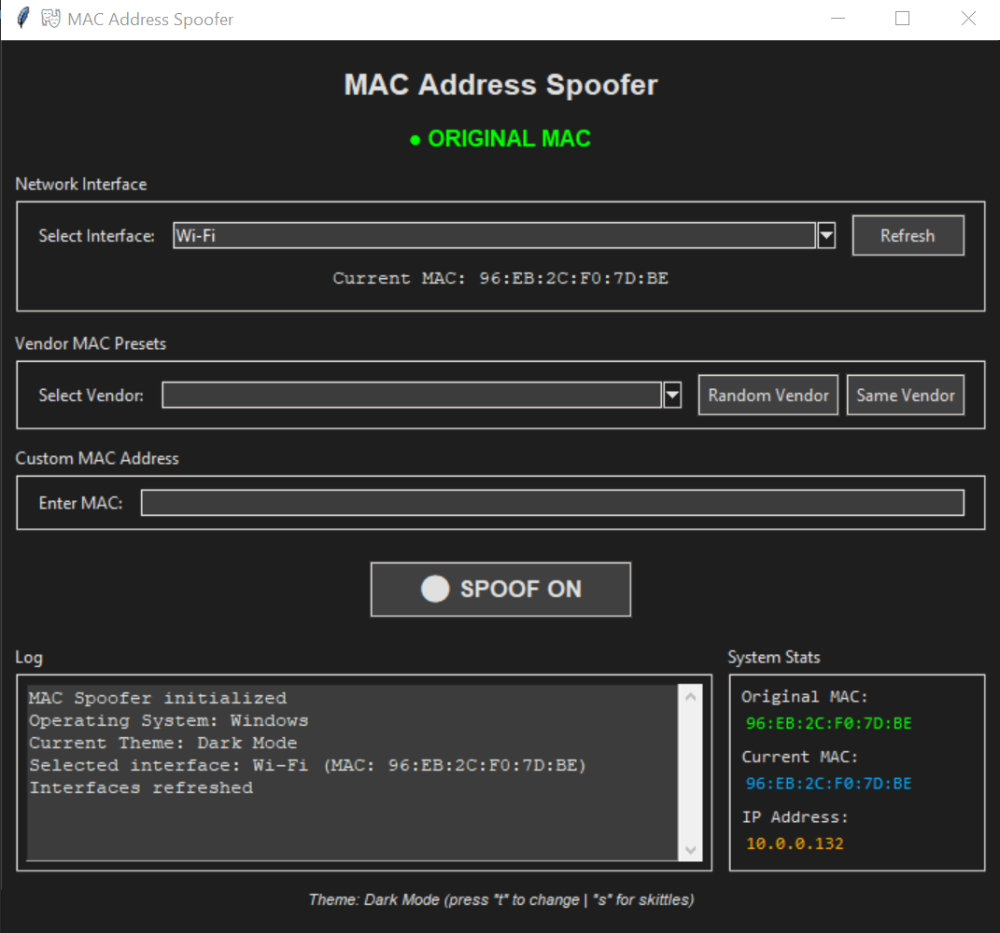

# MAC Address Spoofer (My Ass Covered! Tool)

A cross-platform MAC address spoofing tool with both GUI and command-line interfaces. Change your network adapter's MAC address for privacy, testing, or network troubleshooting purposes.


## Features

- **Easy-to-use GUI** - Intuitive graphical interface with multiple theme options
- **11 Beautiful Themes** - Dark Mode, Flash Bang, Cyberpunk, Matrix, Ocean, Sunset, Hacker Green, Purple Haze, Nord, Dracula, and Skittles (randomized rainbow)
- **Theme Switcher** - Press 'T' key to cycle through themes instantly
- **One-click toggle** - Quick ON/OFF MAC spoofing button
- **45+ vendor presets** - Authentic MAC addresses from major manufacturers with country information (Apple, Samsung, Huawei, Cisco, etc.) - Intel Wi-Fi compatible!
- **Custom MAC input** - Set any specific MAC address you need
- **Random MAC generation** - Generate completely random MAC addresses
- **Original MAC restoration** - Safely restore your original MAC address
- **Real-time status indicator** - Visual feedback showing current spoofing state
- **Live System Stats Panel** - Real-time monitoring of Original MAC, Current MAC, and IP Address (updates every second)
- **VPN Monitoring** - Track IP address changes in real-time when using VPNs or network changes
- **Activity logging** - Detailed log of all operations
- **Cross-platform support** - Works on Windows, Linux, and macOS

## Screenshots



*MAC Address Spoofer GUI with Dark Mode theme showing spoofed MAC status*

## Installation

### Prerequisites

- **Python 3.x** or higher
- **Administrator/Root privileges** (required for changing network settings)

### Clone or Download

```bash
git clone https://github.com/ringmast4r/mac-spoofer.git
cd mac-spoofer
```

Or download the ZIP file and extract it.

## Usage

### GUI Version (Recommended)

**Windows:**
```bash
# Right-click "Run_MAC_Spoofer.bat" and select "Run as administrator"
# Or from command line:
python mac_spoofer_gui.py
```

**Linux/macOS:**
```bash
sudo python3 mac_spoofer_gui.py
```

### Command-Line Version

```bash
# List available network interfaces
python mac_spoofer.py -l

# Spoof with random MAC
python mac_spoofer.py -i "WiFi" -r

# Spoof with custom MAC
python mac_spoofer.py -i "WiFi" -m 00:11:22:33:44:55

# Show help
python mac_spoofer.py -h
```

## How to Use (GUI)

1. **Launch the application** as Administrator/Root
   - Windows: Right-click → "Run as administrator"
   - Linux/macOS: Use `sudo`

2. **Select your network interface** from the dropdown menu
   - Click "Refresh" if your adapter doesn't appear

3. **Choose a spoofing method:**

   **Method A - Quick Random MAC:**
   - Click **"⚫ SPOOF ON"** to instantly spoof with a random MAC
   - Button changes to **"🟢 RESTORE ORIGINAL"** when actively spoofing
   - Click **"🟢 RESTORE ORIGINAL"** to restore your original MAC

   **Method B - Vendor MAC (Two Steps):**
   - **Step 1:** Click **"Use Random Vendor"** to select a random vendor (e.g., Apple, Samsung)
     - OR manually select a vendor from the dropdown
     - This only *selects* the vendor, doesn't activate spoofing yet
   - **Step 2:** Click **"⚫ SPOOF ON"** to apply the selected vendor's MAC
   - Each click of "Use Random Vendor" cycles through different vendors

   **Method C - Custom MAC (Two Steps):**
   - **Step 1:** Enter your desired MAC in the format `00:11:22:33:44:55`
   - **Step 2:** Click **"Use Custom MAC"** to apply it immediately

4. **Restore original MAC:**
   - Click **"🟢 RESTORE ORIGINAL"** to restore your original MAC address

5. **Monitor System Stats (Live Updates):**
   - **System Stats panel** on the right side shows real-time information:
     - **Original MAC**: Your adapter's original MAC address (stored when first selected)
     - **Current MAC**: Live MAC address (updates every second - shows spoofed MAC when active)
     - **IP Address**: Live IP address (updates every second - perfect for VPN monitoring)
   - Use this to verify MAC spoofing is working
   - Monitor IP changes when connecting/disconnecting VPNs
   - All stats update automatically every second

6. **Change Themes:**
   - Press **'T'** key anytime to cycle through 11 different color themes
   - Press **'S'** key to randomize Skittles theme (generates new random colors instantly!)
   - Available themes:
     - **Dark Mode** - Classic dark theme (default)
     - **Flash Bang** - Blinding light theme (⚠️ eye protection recommended)
     - **Cyberpunk** - Neon cyberpunk aesthetic
     - **Matrix** - Green on black hacker style
     - **Ocean** - Cool ocean blues
     - **Sunset** - Warm sunset purples
     - **Hacker Green** - Terminal-style green
     - **Purple Haze** - Deep purple vibes
     - **Nord** - Popular Nord color scheme
     - **Dracula** - Popular Dracula theme
     - **Skittles** - Random rainbow colors (regenerates each time!)

## Vendor MAC Addresses

The tool includes authentic MAC address prefixes (OUI) for **45+ vendors** from the IEEE OUI database, organized by country:

### By Country
- **🇺🇸 USA (17 vendors)**: Apple, Cisco, Dell, HP, Intel, Microsoft, Google, Amazon, Motorola, Texas Instruments, Netgear, Roku, Ubiquiti, Aruba Networks, Juniper Networks, Ruckus Wireless, IBM, Broadcom, Qualcomm, Nvidia, 3Com, Linksys, Belkin

- **🇨🇳 China (9 vendors)**: Huawei, Lenovo, Xiaomi, OPPO, Vivo, ZTE, Espressif, Realme, Honor

- **🇰🇷 Korea (2 vendors)**: Samsung, LG

- **🇯🇵 Japan (5 vendors)**: Sony, Nintendo, Toshiba, Panasonic, Fujitsu

- **🇹🇼 Taiwan (3 vendors)**: ASUS, D-Link, HTC

- **🇭🇰 Hong Kong (1 vendor)**: TP-Link

- **🇫🇮 Finland (1 vendor)**: Nokia

### Top Vendors by Range Count
1. **Huawei** (China) - 1,877 ranges
2. **Apple** (USA) - 1,431 ranges
3. **Cisco** (USA) - 1,310 ranges
4. **Samsung** (Korea) - 908 ranges
5. **Intel** (USA) - 646 ranges

Each vendor has 7-10 authentic MAC address prefixes extracted from the official IEEE Standards Association OUI database.

## Platform-Specific Notes

### Windows
- Some network adapters may require manual MAC change via Device Manager
- The application provides instructions in the log window
- You may need to disable/enable the adapter after changing MAC
- Some WiFi adapters don't support MAC spoofing
- Registry method is used to set MAC addresses

### Linux
- Requires `root` privileges (use `sudo`)
- Uses `ip link` commands to change MAC addresses
- Works with most network adapters

### macOS
- Requires `root` privileges (use `sudo`)
- Uses same commands as Linux
- May require disabling System Integrity Protection for some adapters

## Troubleshooting

### Application won't start
- Ensure Python 3.x is installed: `python --version`
- Run as administrator/root
- Check if tkinter is installed: `python -m tkinter`

### MAC address won't change
- **Windows:** Some adapters require manual change via Device Manager (see log for instructions)
- Verify your adapter supports MAC address changes
- Try a different network adapter
- Check administrator/root privileges

### Interface not showing
- Click the **"Refresh"** button
- Restart the application
- Verify the adapter is enabled in your system settings

### How to verify MAC changed
- **Windows:** Run `ipconfig /all` in Command Prompt and check "Physical Address"
- **Linux/macOS:** Run `ip link show` or `ifconfig` and look for the interface

### Spoofing doesn't persist after reboot
- This is expected behavior
- MAC spoofing is temporary and resets when the adapter or system restarts
- Re-run the spoofer after each reboot if needed

## Technical Details

### How It Works

**Windows:**
- Modifies the `NetworkAddress` registry key for the network adapter
- Registry path: `HKEY_LOCAL_MACHINE\SYSTEM\CurrentControlSet\Control\Class\{4D36E972-E325-11CE-BFC1-08002BE10318}`
- Disables and re-enables the adapter to apply changes

**Linux/macOS:**
- Uses `ip link` or `ifconfig` commands
- Brings interface down, changes MAC, brings it back up

### MAC Address Format

- Standard format: `00:11:22:33:44:55`
- First 3 bytes (octets): Manufacturer OUI (Organizationally Unique Identifier)
- Last 3 bytes: Device-specific identifier
- Locally administered MACs have bit 1 of first octet set to 1

## Security & Legal

### Disclaimer

**This tool is for legitimate purposes only:**
- Network testing and troubleshooting
- Privacy protection on public networks
- Security research and education
- Device testing and development

**Important warnings:**
- Spoofing MAC addresses may violate network terms of service
- Unauthorized network access is illegal
- Use responsibly and only on networks you own or have permission to test
- Some jurisdictions may have specific laws regarding MAC spoofing

### Ethical Use

This tool is designed for:
- ✅ Personal privacy on public WiFi
- ✅ Network administration and testing
- ✅ Security research in controlled environments
- ✅ Educational purposes

**NOT for:**
- ❌ Bypassing network authentication
- ❌ Evading bans or restrictions
- ❌ Unauthorized network access
- ❌ Any illegal activities

## Contributing

Contributions are welcome! Please feel free to submit pull requests or open issues for bugs and feature requests.

### Development

```bash
# Clone the repository
git clone https://github.com/yourusername/mac-spoofer.git

# Create a new branch
git checkout -b feature/your-feature

# Make your changes and commit
git commit -am "Add new feature"

# Push to your fork
git push origin feature/your-feature

# Create a Pull Request
```

## License

This project is licensed under the **MIT License** with additional disclaimers for liability protection.

**Key Points:**
- ✅ Free to use, modify, and distribute
- ✅ No warranty provided - use at your own risk
- ✅ Authors not liable for any damages or misuse
- ✅ Must be used legally and responsibly
- ✅ Users accept full responsibility for consequences

See the [LICENSE](LICENSE) file for complete terms and conditions.

## Acknowledgments

- IEEE OUI database for vendor MAC prefixes
- Python tkinter for the GUI framework
- Community contributors and testers

## Support

If you encounter any issues or have questions:
- Open an issue on GitHub
- Check the troubleshooting section above
- Review the log output for error details

## Future Features & Roadmap

We're constantly working to improve MAC Address Spoofer! Here are some planned features:

### 🔥 High Priority
- **MAC History & Session Tracking**
  - Track previously used MAC addresses with timestamps
  - Quick reuse dropdown to easily switch back to a recent MAC
  - View when each MAC was used (date/time)
  - Optional session notes and duration tracking
  - **Privacy-focused design:**
    - OFF by default (must be explicitly enabled)
    - Auto-delete entries after 30 days (configurable)
    - Optional encryption for history file
    - One-click "Clear All History" button
    - Session-only mode (clears on exit)
  - Configurable history limit (20-50 MACs)

### 🎨 Theme Enhancements
- Save and load favorite themes
- Custom theme creator with color picker
- Import/export themes to share with others
- Animated theme transitions

### 🔧 MAC Management
- Per-interface MAC address profiles
- Scheduled MAC rotation/randomization
- Expanded vendor database (100+ manufacturers)
- MAC address groups and profiles
- Backup/restore all settings

Want to contribute or suggest a feature? Open an issue on GitHub!

## Changelog

### Version 1.5.0
- **MAJOR FIX:** Intel Wi-Fi adapter compatibility - All vendor MACs now work on Intel adapters
- Vendor MACs auto-converted to locally administered format (Intel compatible)
- Added double-restart logic for 100% reliable spoofing (resets to hardware MAC first)
- Fixed System Stats panel - Now shows actual spoofed MAC in real-time (uses PowerShell Get-NetAdapter)
- Fixed status indicator - Original MAC shows solid green, Spoofed MAC pulses red
- Fixed button width - "RESTORE ORIGINAL" text no longer cut off
- Increased adapter restart delays from 1-2 seconds to 3 seconds for Intel compatibility
- Spoofing process now takes 12-15 seconds (slower but fully reliable)
- Verified working on Intel Wi-Fi 6 AX201 with all vendor presets

### Version 1.4.0
- Added **Live System Stats Panel** with real-time monitoring (updates every second)
- **Original MAC** display - Always visible to remember your original address
- **Current MAC** live tracking - See spoofed MAC changes in real-time
- **IP Address** live monitoring - Perfect for VPN connection verification
- Split log area into Log (left) and System Stats (right) panels
- Real-time updates enable instant verification of MAC spoofing and network changes
- **Single large toggle button:** "⚫ SPOOF ON" / "🟢 RESTORE ORIGINAL" controls everything
- Button is bigger, taller, and more prominent (16pt bold with extra padding)
- **Simplified workflow:** "Use Random Vendor" now only selects vendor (doesn't activate)
- Removed redundant buttons: "Generate Random MAC" and "Restore Original"
- Cleaner, more intuitive interface with single activation method

### Version 1.3.0
- Added 11 beautiful color themes (Dark, Flash Bang, Cyberpunk, Matrix, Ocean, Sunset, Hacker Green, Purple Haze, Nord, Dracula, Skittles)
- Press 'T' key to cycle through themes instantly
- Press 'S' key for Skittles-only randomization (endless color variations!)
- Skittles theme generates 16 random bright colors for a rainbow effect
- Theme indicator discreetly placed at bottom of window

### Version 1.2.0
- Improved visual indicator on SPOOF ON/OFF button
- Changed button indicator: ⚫ (grey) = Original MAC, 🟢 (green) = Spoofed MAC
- Added comprehensive MIT License with liability protection
- Enhanced user clarity for spoofing status

### Version 1.1.0
- Expanded to 45+ vendor presets with country information
- Added major vendors: Xiaomi, Espressif, OPPO, Vivo, Google, Nintendo, Amazon, Broadcom, Qualcomm, Nvidia, and more
- Country-based vendor organization (USA, China, Korea, Japan, Taiwan, Hong Kong, Finland)
- Extracted comprehensive MAC prefixes from official IEEE OUI database files
- Each vendor now has 7-10 authentic MAC address prefixes

### Version 1.0.0
- Initial release
- GUI and CLI versions
- Cross-platform support (Windows, Linux, macOS)
- Dark mode theme
- One-click toggle functionality
- Original MAC restoration

---

**⚠️ Use at your own risk. Always comply with local laws and network policies.**

